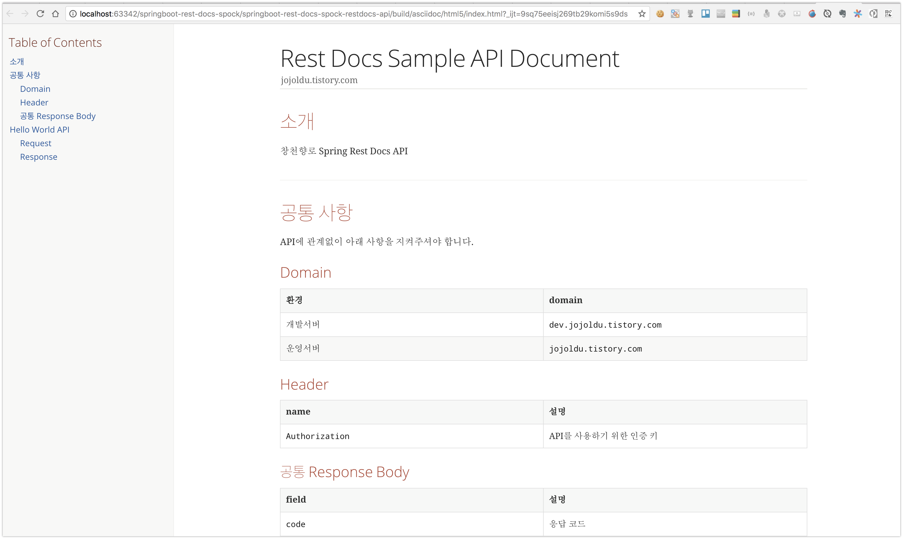

# Gradle Multi Module에서 Spring Rest Docs 사용하기

[지난 시간](http://jojoldu.tistory.com/289)에 이어 이번시간에는 Markdown이 아닌 Asciidoc으로 Spring Rest Docs를 진행하는 과정을 기록합니다.  
  
> 단일 프로젝트에서 기본 버전 (MockMVC + Junit4) 적용 방법은 [레퍼런스 번역](http://springboot.tistory.com/26)을 참고하시면 됩니다.

여기서는 Spring Rest Docs + Spock + Rest Assured를 조합으로 진행할 예정입니다.  
(저희팀 프로젝트 스펙이라서요..)  
  
[Gradle Muliti Module](http://jojoldu.tistory.com/123)의 경우 요즘 많은 프로젝트에서 사용하고 있으니 여기서도 마찬가지로 적용된걸 가정하고 진행합니다.  
  
모든 코드는 [Github](https://github.com/jojoldu/springboot-rest-docs-spock)에 있으니 참고하시면 될것 같습니다.

## 1. Gradle Multi Module 구성

먼저 프로젝트를 Gradle Multi Module로 구성하겠습니다.  


> Gradle Multi Module 구성이 처음이시라면 이전에 작성된 [포스팅](http://jojoldu.tistory.com/123)을 참고해서 한번 시도해보세요!


* 외부에 제공될 API인 restdocs-api 모듈
* 도메인을 담은 restdocs-core 모듈

2가지입니다.  
실제 프로젝트 환경에선 이보다 훨씬더 많은 구성을 가지겠지만, 여기서는 간단하게 2개만 구성해서 진행합니다.  
중요한 점은 **restdocs-api는 Spring Rest Docs로 문서를 제공**하고, **restdocs-core는 문서를 제공하지 않는다**는 것입니다.  
  
그리고 **Root 프로젝트의 build.gradle** 구성을 아래와 같이 간단하게 가져갑니다.

```groovy
buildscript {
    ext {
        springBootVersion = '2.0.1.RELEASE'
    }
    repositories {
        mavenCentral()
    }
    dependencies {
        classpath("org.springframework.boot:spring-boot-gradle-plugin:${springBootVersion}")
    }
}

task wrapper(type: Wrapper) {
    gradleVersion = '4.5.1'
}

subprojects {
    apply plugin: 'java'
    apply plugin: 'groovy' // for spock
    apply plugin: 'eclipse'
    apply plugin: 'org.springframework.boot'
    apply plugin: 'io.spring.dependency-management'

    group = 'com.jojoldu.spring'
    version = '0.0.1-SNAPSHOT'
    sourceCompatibility = 1.8

    repositories {
        mavenCentral()
    }

    dependencies {
        compile('org.springframework.boot:spring-boot-starter')
        compileOnly('org.projectlombok:lombok')
        testCompile('org.springframework.boot:spring-boot-starter-test')
        testCompile('org.spockframework:spock-core:1.1-groovy-2.4') // for spock
        testCompile('org.spockframework:spock-spring:1.1-groovy-2.4') // for spock
    }

}
```

위 내용을 보시면 아시겠지만, Root의 build.gradle은 **서브 모듈들에서 공통으로 사용할 의존성들만 추가**하면 됩니다.  
Spring Rest Docs를 사용할 모듈 (여기서는 restdocs-api)에서만 관련된 코드를 추가하면 됩니다.  
  
나머지 기타 설정들 (settings.gradle 등)은 생략하겠습니다.  

> 나머지 설정을 확인하고 싶으신 분들은 [Github](https://github.com/jojoldu/springboot-rest-docs-spock)을 참고해주세요.

## 2. Spring Rest Docs 설정

```groovy
plugins {
    id "org.asciidoctor.convert" version "1.5.3"
}

ext {
    snippetsDir = file('build/generated-snippets')
}

asciidoctor {
    inputs.dir snippetsDir
    dependsOn test
}

jar {
    dependsOn asciidoctor
    from ("${asciidoctor.outputDir}/html5") {
        into 'static/docs'
    }
}

dependencies {
    compile project(":restdocs-core")

    compile('org.springframework.boot:spring-boot-starter-web')

    // rest assured & asciidoc
    compile('org.springframework.restdocs:spring-restdocs-restassured')
    asciidoctor 'org.springframework.restdocs:spring-restdocs-asciidoctor:2.0.1.RELEASE'

    testCompile('io.rest-assured:rest-assured:3.0.2') // for rest assured
    testCompile('org.springframework.restdocs:spring-restdocs-restassured') // for rest assured

}

```

## 3. 테스트 코드 작성

## 4. 결과



## 5. Tip

### Plugin

IntelliJ를 기준으로는 다음과 같이 Asciidoc 플러그인이 제공됩니다.


> VS Code 등 다른 에디터에서도 플러그인이 제공됩니다.

### 문서 생성 목록

| 기본 생성             | 테스트코드에 따라 추가 생성    |
|---------------------|-------------------------|
| curl-request.adoc   | response-fields.adoc    |
| http-request.adoc   | request-parameters.adoc |
| httpie-request.adoc | request-parts.adoc      |
| http-response.adoc  | path-parameters.adoc    |
| request body        | request-parts.adoc      |
| response body       |                         |